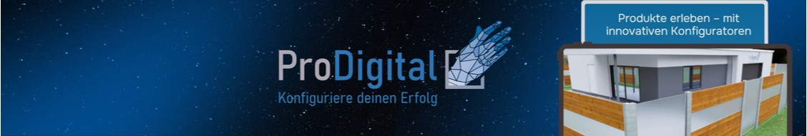

# ProDigital Consulting GmbH

Deutsch | [English](./README.en.md)

Interaktive 3D-Produktkonfiguratoren fuer komplexe Produkte.

Wir helfen Herstellern und Haendlern dabei, Beratung zu digitalisieren, Prozesse zu entlasten und Umsatzpotenziale zu heben.

## Hinweis zu Repositories und Nutzung

- Aktuell werden ueber diese Organisation keine Public Open-Source-Repositories bereitgestellt.
- Inhalte und Software sind proprietaer.
- Sofern nicht schriftlich anders vereinbart, ist keine freie Nutzung, Vervielfaeltigung oder Weitergabe erlaubt.

## Was wir bauen

- 3D-Konfiguratoren fuer Terrasse, Sichtschutz, Fassade, Solar und Treppen...
- Spezialloesungen fuer individuelle Produktlogik und Workflows
- Integrationen in E-Commerce und bestehende Vertriebsprozesse
- Konfigurator-Erlebnisse mit Fokus auf Conversion, weniger Fehler und schnellere Entscheidungen

## Warum das relevant ist

- Bis zu 90% weniger Fehler in der Konfiguration (je nach Use Case)
- Bis zu 40% mehr Umsatzpotenzial durch bessere Conversion
- Bis zu 50% Zeitersparnis in Beratung und Abwicklung
- 723.000+ Nutzer in 2025 auf unseren Konfiguratoren

## Fuer wen wir arbeiten

- Hersteller mit variantenreichen Produkten
- Online-Shops mit beratungsintensiven Sortimenten
- Vertriebsteams, die schneller von Anfrage zu Abschluss wollen

## Auszug unserer Themenwelten

- Outdoor: Terrasse, Sichtschutz
- Indoor: Heizungssysteme, Lichtsysteme, Mobiliar
- Bau und Fassade
- Energie und Solar
- Treppen und Sonderkonfigurationen

## Mehr von uns

- Website: https://www.pro-digital.de/
- Produkt-Konfiguratoren: https://www.pro-digital.de/produktkonfiguratoren
- Case Studies: https://www.pro-digital.de/case-studies
- Ratgeber: https://www.pro-digital.de/ratgeber
- LinkedIn: https://www.linkedin.com/company/prodigital-consulting-gmbh/

## Zusammenarbeit

Wir freuen uns ueber Austausch mit:

- potenziellen Partnern
- Unternehmen mit komplexen Produktdaten
- Teams, die ihren digitalen Vertrieb modernisieren moechten

Termin: https://calendly.com/prodigital-roman-haar/30min

## Community

- [Contribution Guide](../CONTRIBUTING.md)
- Lizenzhinweis: ../LICENSE.md

---

Digital first. Messbar. Nah am Vertrieb.
